# Art By Heart Sketch

Art By Heart Sketch is a website designed for users to view artwork made by the website owner and commisson the owner to draw custom pieces for themselves.

# Motivation

I decided to build this website for my sister who sells her artwork through Instagram, Facebook and Twitter but does not have an easy way to demonstrate her artwork and get buyers specification. The Website fulfils this need and allows her to easily upload her work and find new potential contacts and buyers.   

# Table of contents
1. [Project Description](#project-description)
    1. [Navigation](#navigation)
    2. [Landing Page](#landing-page)
    3. [Gallery](#gallery)
    4. [Commissions](#commissions)
2. [Technologies Used](#technologies-used)
3. [Development](#development)
4. [Deployment](#deployment)
5. [Tests](#tests)
6. [Validators](#Validators)
7. [Features](#features)
8. [Bugs & Solutions](#bugs-&-solutions)
9. [Credits](#credits)

## Project Description 
Art By Heart Sketch is desigend to give the user an example of what kinds of art they can commission from the artist and easily send the artist an email to commission the type of drawing they want. The website uses Python, Django Full Stack Framework, Bootstraps and Cloudinary for static files and image storage.  

- Navigation 

    The website can be navigated via the horizontal top nav-bar which displayes the Home, Gallery, commissions, sign up and log in links. if the User is logged in then     the sign in link is removed from the nav-bar and log out is displayed. also, the Users name they used when signing up will be displayed.
    when the website is displayed on a mobile device the nav-bar will become a burger symbol which expands to reveal all links, that are now displayed vertically. 

    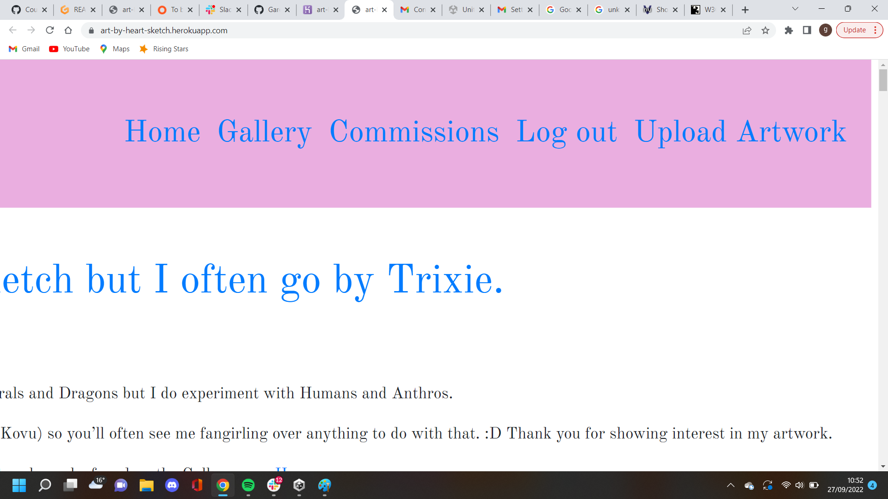

- Landing Page 

    The landing page is a read only page that demostrates what the user will get and the prices that the artist will charge. 

    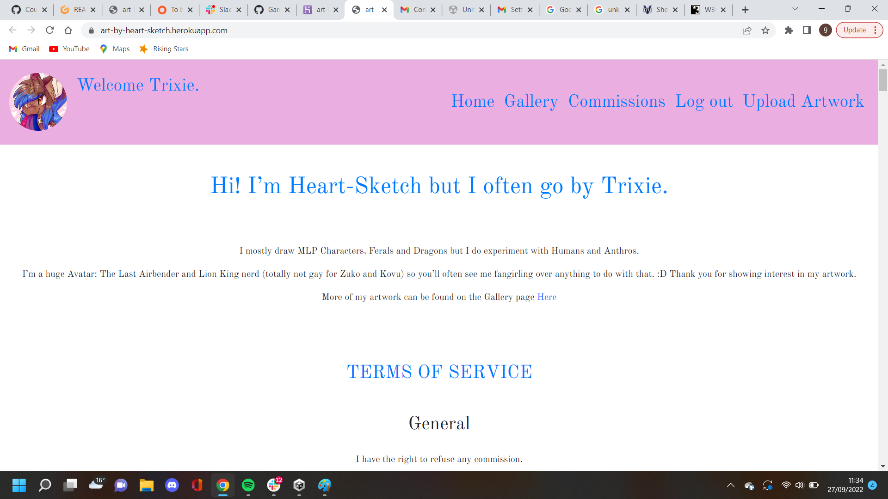
    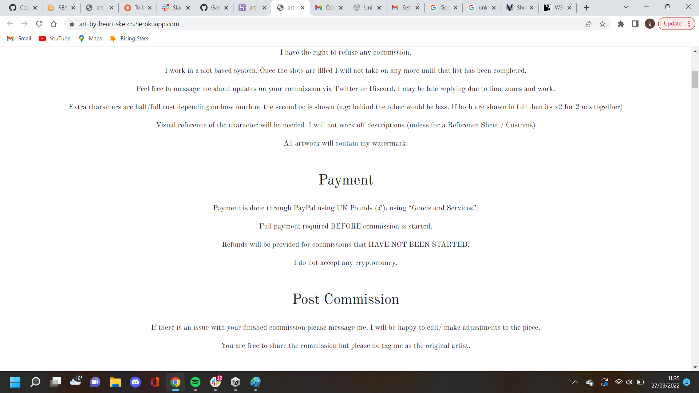
    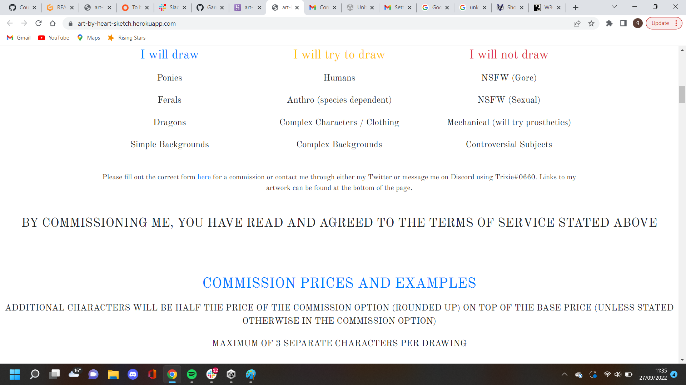
    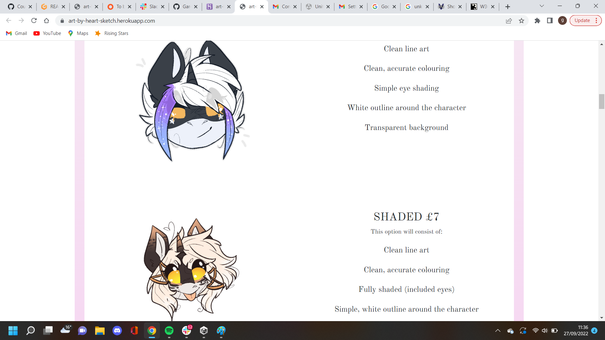
    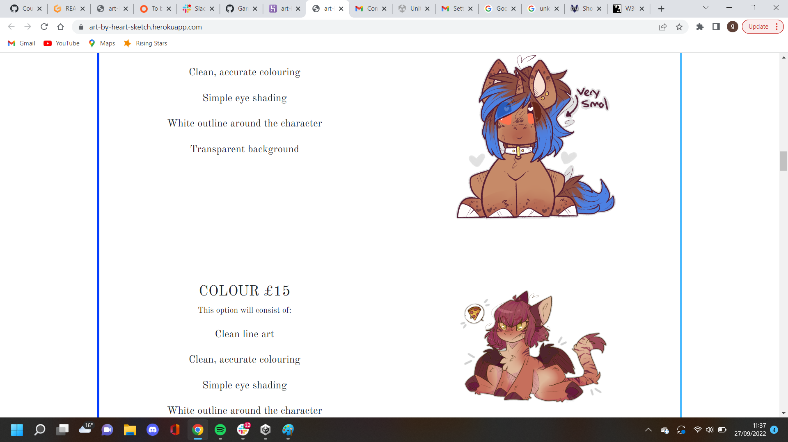
    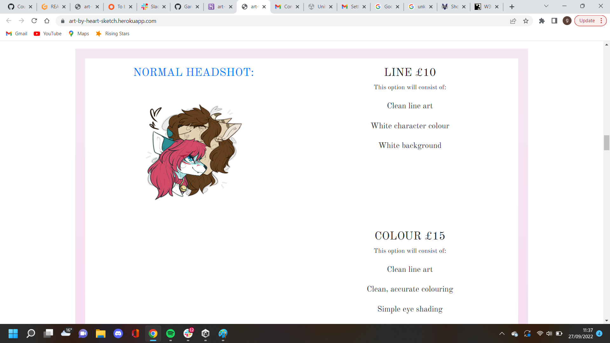
    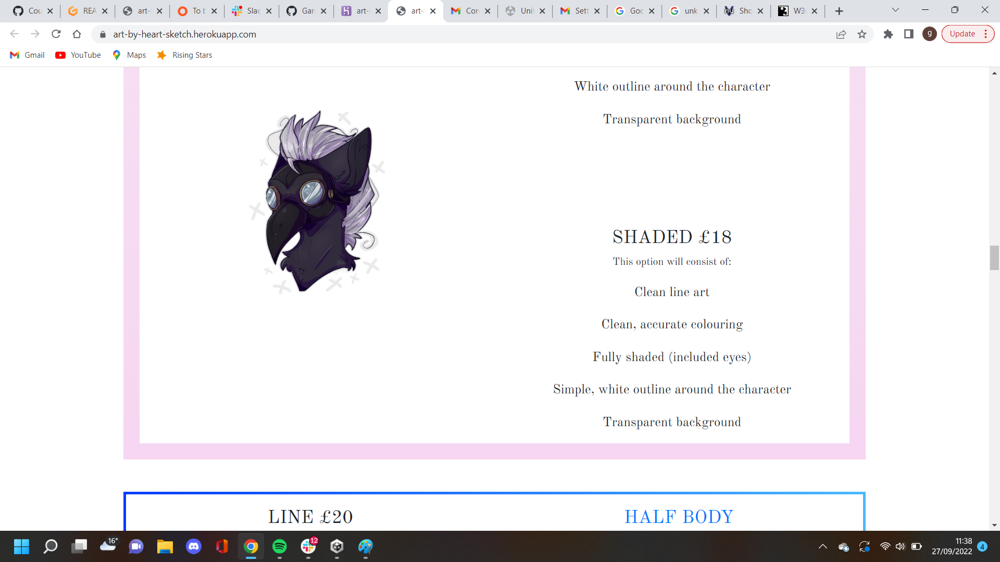
    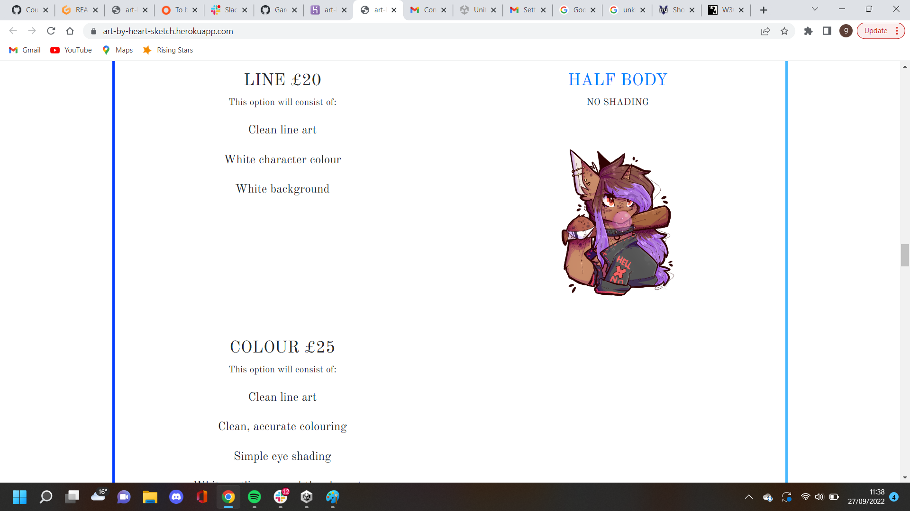
    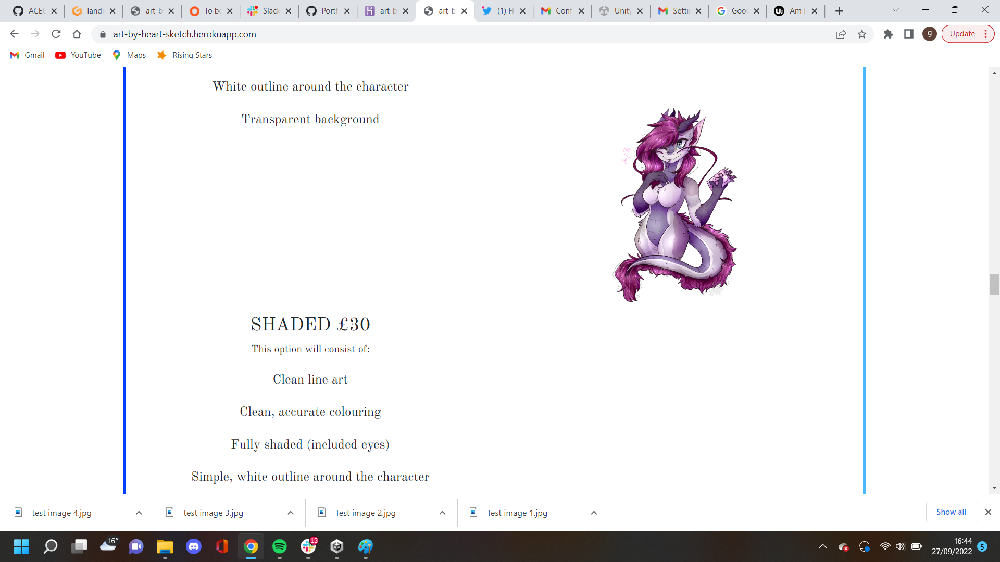
    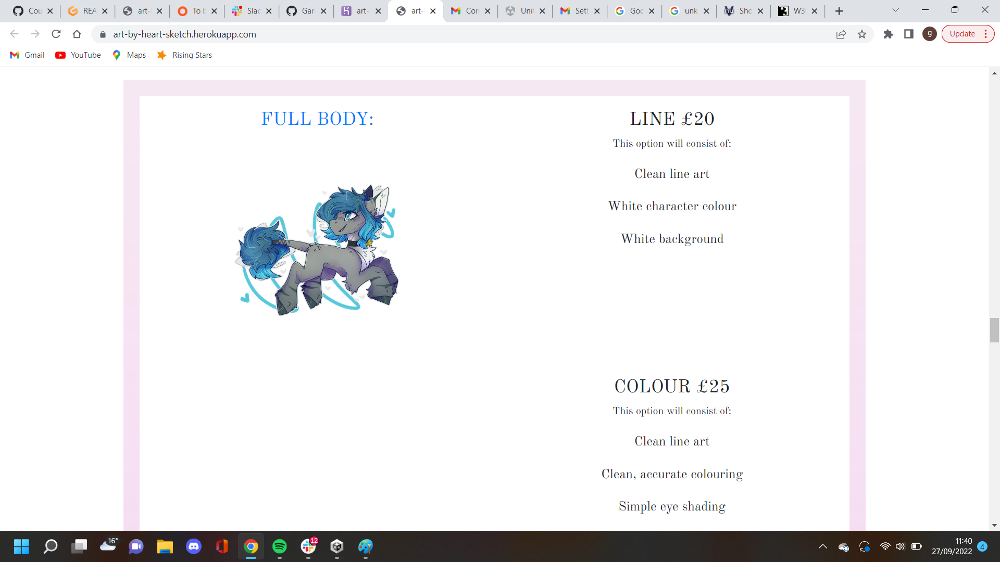
    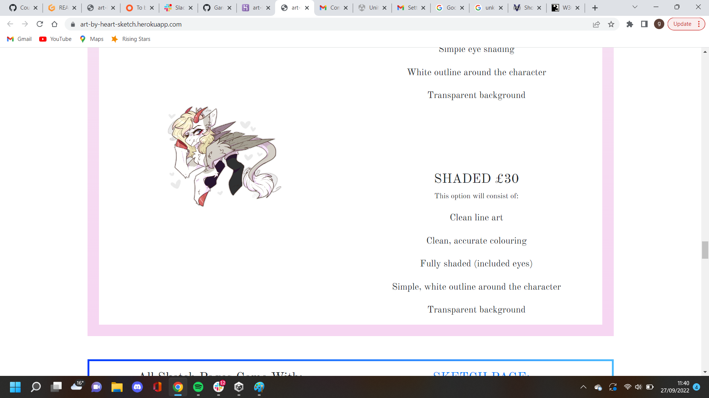
    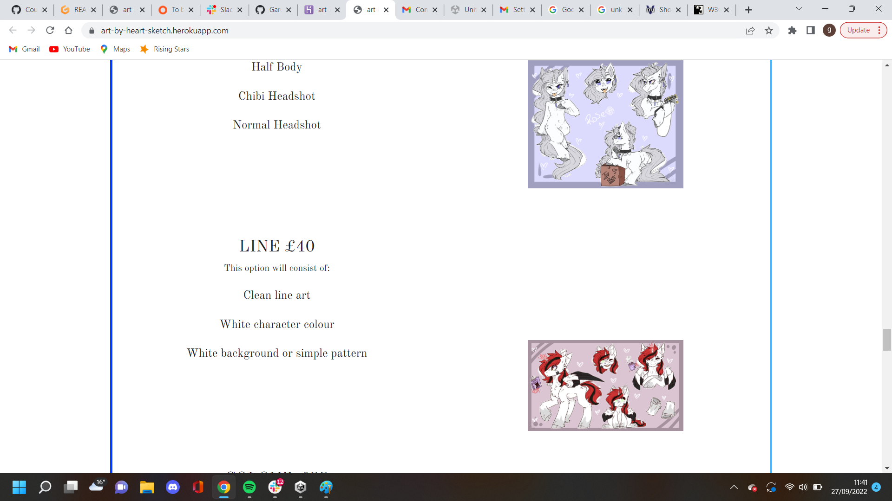
    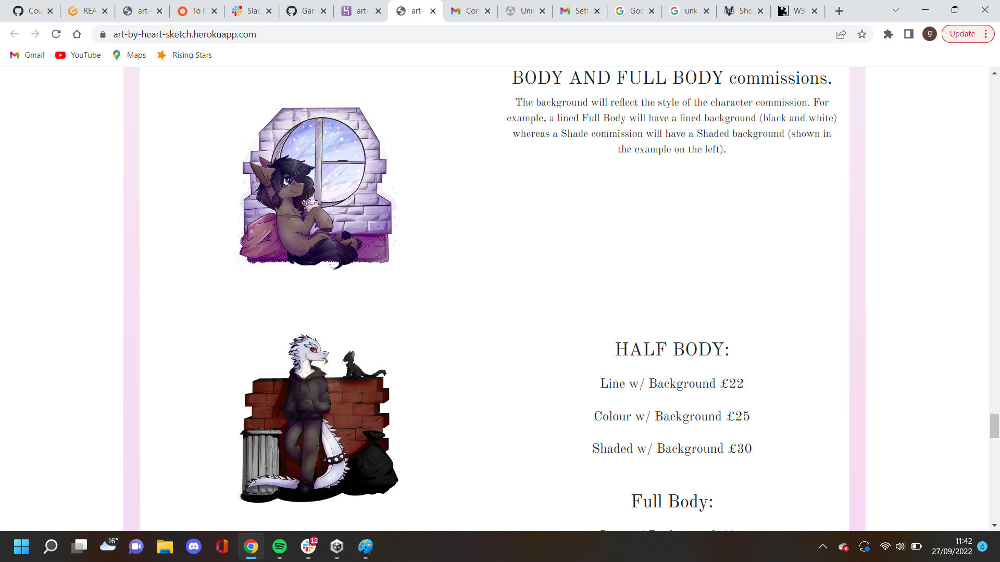
    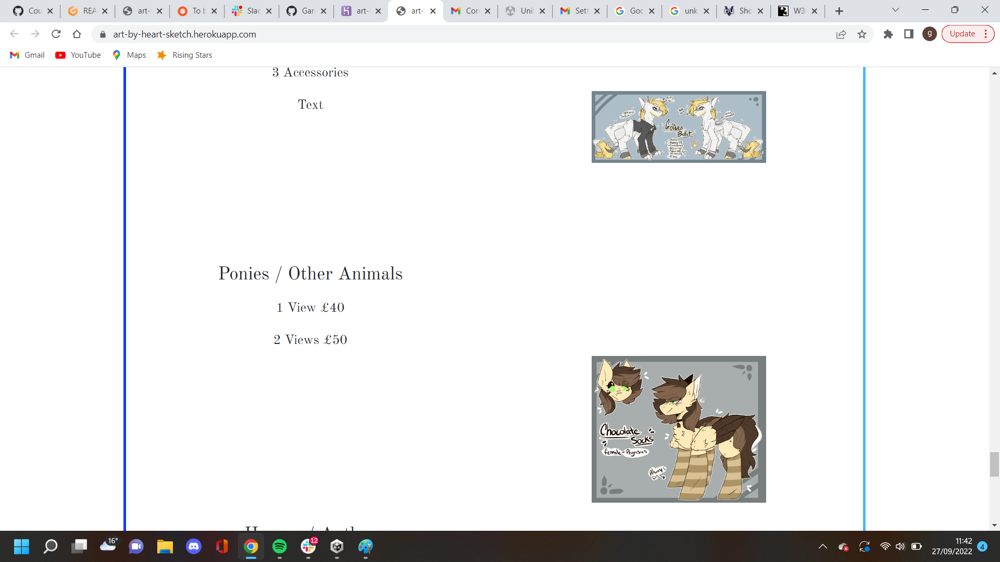
    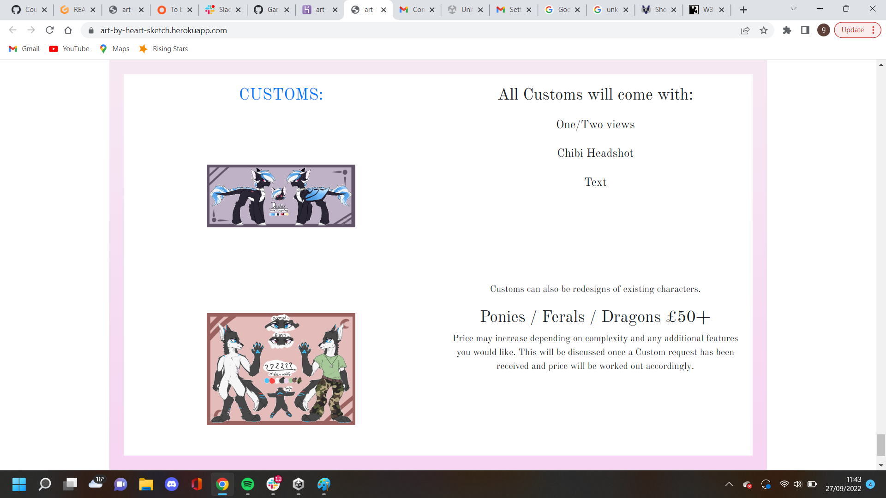

- Gallery 

    The gallery page displayes any art that the admin/artist uploads and allows users to comment on the indivisual pieces.

- Commissions 

    The commissions page contains three forms (normal commissions, reference sheets and customs) that can be filled in by the user. Once a form is filled in and            submited an email is sent to the artist that contains all the relevant information the artists needs to contact the user and begin drawing a commission. 

## Technologies Used 
  For this project the main technologies used were Python, Django, Bootstraps and Cloudinary. 
  Python was used as it is required for Django and Django was used to save time when creating databases, authorization, tests, ect. 
  Cloudinary was used to store static files and images when the website is deployed on Heroku, as Heroku will delete images when the dynos are reset. 
  Bootstraps was used to enable easy editing of html and css elements so the wesite could be developed faster. 
  
  Along with the above technologies many python modules were installed, the full list can be seen below:
  - asgiref==3.5.2
  - boto3==1.24.41
  - botocore==1.27.41
  - cloudinary==1.29.0
  - dj-database-url==0.5.0
  - dj3-cloudinary-storage==0.0.6
  - Django==3.2.14
  - django-allauth==0.51.0
  - django-ses==3.1.0
  - fontawesomefree==6.1.1
  - gunicorn==20.1.0
  - jmespath==1.0.1
  - oauthlib==3.2.0
  - psycopg2==2.9.3
  - PyJWT==2.4.0
  - python3-openid==3.2.0
  - pytz==2022.1
  - requests-oauthlib==1.3.1
  - s3transfer==0.6.0
  - sqlparse==0.4.2
  - whitenoise==6.2.0

## Development 

  The Art By Heart Sketch website was developed with the agile method. A Kanban board was used with user stories added to it, each detailing a different function of     the website. All User stories were completed in 1 iteration. All phases of Agile development can be seen in the images below.

## Deployment 
  
  The Art By Heart Sketch website was deployed on Heroku using the following steps:
  
  1.  I prepared Procfile
  2.  I created the app art-by-heart-sketch on Heroku 
  3.  I navigated to the resources tab and added the Heroku postgres add on pack 
  4.  Then I connected the postgres data base url in my repository
  5.  On the Heroku website I then navigated to the deployment tab and connect my Github repository to Heroku 
  6.  I allowed automatic commits so that Heroku would always have the current version of my app 
  7.  I set up the config vars on the setting tab
  8.  Then I successfully deployed my app using the deploy branch button. 

## Tests 

- Unit Testing 

  Both automated and manual testing has been performed on this projects. 
  
  All automated tests can be found in the tests.py file.
  
  unittest tests simple things like urls being resolved.

  
 

- Functional testing 

  Authentication

  Description: 

  Makes sure a user can sign up to the website

  Steps:

  1. Navigate to [art-by-heart-sketch](https://art-by-heart-sketch.herokuapp.com/) and click on the sign up link.
  2. Enter email(optional), username and password.
  3. Click Sign up.
  
  Expected:

  The users username is displayed in the navbar and they can comment on the gallery page.

  Actual: 

  The users username is displayed in the navbar.

  

  Description: 

  Makes sure a user can log in once they are signed up

  Steps:

  1. Navigate to [art-by-heart-sketch](https://art-by-heart-sketch.herokuapp.com/) and click on the log in link.
  2. Enter username and password.
  3. Click log in.
  
  Expected:

  The user to be taken to the home page and their username to be displayed on the navbar.

  Actual: 

  The user to be taken to the home page and their username to be displayed on the navbar.

  

Description: 

  Makes sure a user can log out once they are logged in.

  Steps: 

  1. Navigate to [art-by-heart-sketch](https://art-by-heart-sketch.herokuapp.com/) and click on the log out link.
  2. The user is presented with a question asking if they are sure they wish to log out.
  3. Click the log out button. 

  Expected: 

  User is redirected to the home page and username no longer visible.

  Actual:

  User is redirected to the home page and username no longer visible.

  

  Description: 

  Upload Artwork link displayed when logged in as superuser.

  Steps: 

  1. Navigate to [art-by-heart-sketch](https://art-by-heart-sketch.herokuapp.com/) and click on the log in link.
  2. Log in as a superuser.
  3. The superuser can now see the upload artwork link in the navbar.

  Expected: 

  Superuser is now able to see the upload artwork link in the navbar.

  Actual:

  Superuser is now able to see the upload artwork link in the navbar.

  
 

   Description: 

   Upload Artwork link allows a superuser to upload new artwork with a title.

  Steps: 

  1. Navigate to [art-by-heart-sketch](https://art-by-heart-sketch.herokuapp.com/) and click on the log in link.
  2. Log in as a superuser.
  3. The superuser can now see the upload artwork link in the navbar.
  4. Click the upload artwork link. 
  5. The superuser is taken to a new page with the title charfield and images selection field.
  6. The superuser types a title and selcts an image from thier files.
  7. Click the upload button.
  8. The superuser is then taken to the gallery page.

  Expected: 

  The title and image that the superuser has selected is displyed on the Gallery page.

  Actual:

  The title and image that the superuser has selected is displyed on the Gallery page.

  

  Description: 

  Able to see add comment link only when logged in.

  Steps: 

  1. Navigate to [art-by-heart-sketch](https://art-by-heart-sketch.herokuapp.com/) and click on the log in link.
  2. Log in.
  3. Navigate to [art-by-heart-sketch](https://art-by-heart-sketch.herokuapp.com/gallery/)
  4. The user is now able to see the add comment button on the gallery page. 

  Expected: 

  User is able to see add comment link.

  Actual:

  User is able to see add comment link.

  

  Description: 

  User is able to add a comment when logged in.

  Steps: 

  1. Navigate to [art-by-heart-sketch](https://art-by-heart-sketch.herokuapp.com/) and click on the log in link.
  2. Log in.
  3. Navigate to [art-by-heart-sketch](https://art-by-heart-sketch.herokuapp.com/gallery/)
  4. The user is now able to add a comment to a piece of uploaded artwork.  

  Expected: 

  User is able to add a comment.

  Actual:

  User is able to add a comment.

  

  Description: 

  User is able to update only their own comments when logged in.

  Steps: 

  1. Navigate to [art-by-heart-sketch](https://art-by-heart-sketch.herokuapp.com/) and click on the log in link.
  2. Log in.
  3. Navigate to [art-by-heart-sketch](https://art-by-heart-sketch.herokuapp.com/gallery/)
  4. The user can now only update comments that they have added.   

  Expected: 

  User is able to update only their own comments.

  Actual:

  User is able to update only their own comments.

  

   Description: 

  User is able to delete only their own comments when logged in.

  Steps: 

  1. Navigate to [art-by-heart-sketch](https://art-by-heart-sketch.herokuapp.com/) and click on the log in link.
  2. Log in.
  3. Navigate to [art-by-heart-sketch](https://art-by-heart-sketch.herokuapp.com/gallery/)
  4. The user can now only delete comments that they have added.   

  Expected: 

  User is able to delete only their own comments.

  Actual:

  User is able to delete only their own comments.

  

   Description: 

  User is able to fill in normal commssion form and see success message.

  Steps: 

  1. Navigate to [art-by-heart-sketch](https://art-by-heart-sketch.herokuapp.com/commissions/).
  2. Fill in the normal commissions form.
  3. Click submit.
  4. The user is shown a success message.

  Expected: 

  User is able to fill in normal commissions form and see success message.

  Actual:

  User is able to fill in normal commissions form and see success message.

  

  Description: 

  User is able to fill in reference sheet form and see success message.

  Steps: 

  1. Navigate to [art-by-heart-sketch](https://art-by-heart-sketch.herokuapp.com/commissions/).
  2. Fill in the reference sheet form.
  3. Click submit.
  4. The user is shown a success message.

  Expected: 

  User is able to fill in reference sheet form and see success message.

  Actual:

  User is able to fill in reference sheet form and see success message.

  

  Description: 

  User is able to fill in the custom form and see success message.

  Steps: 

  1. Navigate to [art-by-heart-sketch](https://art-by-heart-sketch.herokuapp.com/commissions/).
  2. Fill in the custom form.
  3. Click submit.
  4. The user is shown a success message.

  Expected: 

  User is able to fill in the custom form and see success message.

  Actual:

  User is able to fill in the custom form and see success message.

  

  Description: 

  The normal commissions form information is received and read through a gmail account.

  Steps: 

  1. Go to [www.gmail.com](https://mail.google.com/mail/).
  2. Log into account 
  3. View new email to see if the information has been received.

  Expected: 

  All information filled in on normal commissions form appears in email inbox.

  Actual:

  All information filled in on normal commissions form appears in email inbox.

  

  Description: 

  The normal reference sheet form information is received and read through a gmail account.

  Steps: 

  1. Go to [www.gmail.com](https://mail.google.com/mail/).
  2. Log into account 
  3. View new email to see if the information has been received.

  Expected: 

  All information filled in on reference sheet form appears in email inbox.

  Actual:

  All information filled in on reference sheet form appears in email inbox.

  

  Description: 

  The normal custom form information is received and read through a gmail account.

  Steps: 

  1. Go to [www.gmail.com](https://mail.google.com/mail/).
  2. Log into account 
  3. View new email to see if the information has been received.

  Expected: 

  All information filled in on custom form appears in email inbox.

  Actual:

  All information filled in on custom form appears in email inbox.

## Validators 

Art by heart sketch has been run through Lighthouse, W3C CSS validator, W3C HTML validator and pep8 Python validator.

All results can be seen below:

### Lighthouse

### WC3 CSS

This validator throws a Java lang error but unfortunatly I could not find the cause of this error.

The White space warnings have been fixed. 

All warnings are caused by Bootstraps and can be ignored.

### WC3 HTML

## Features  

## Bugs & Solutions  

## Credits 